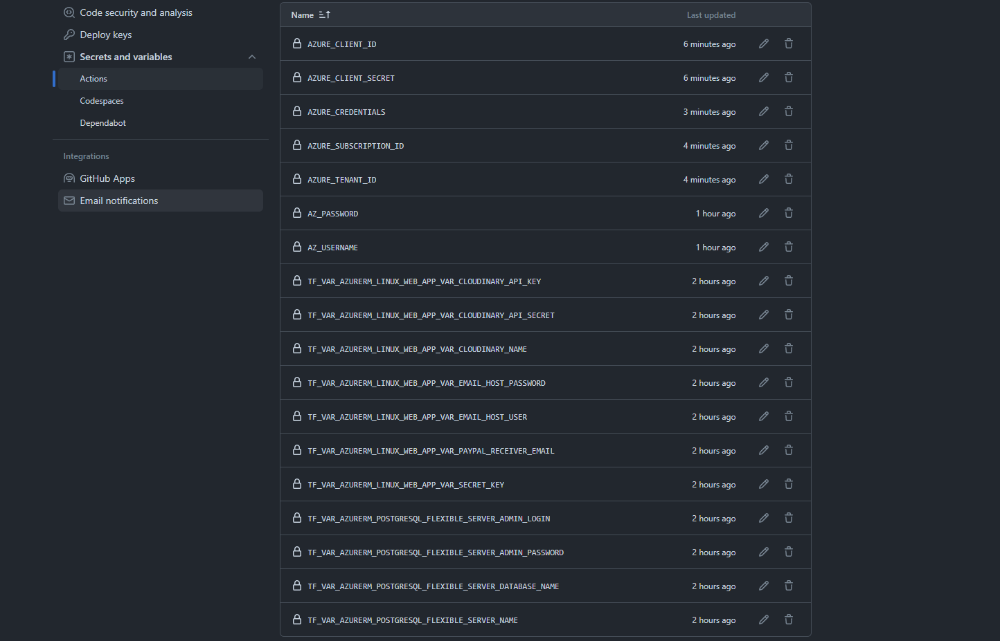

# Deploying to Azure with terraform CI/CD

1. Run the commands in sh_commands.sh. The storage is created to keep the tfstate file, so it doesn't deploy new infrastructure on a new push.
2. Add the variables for the CI/CD and the Azure Credentials